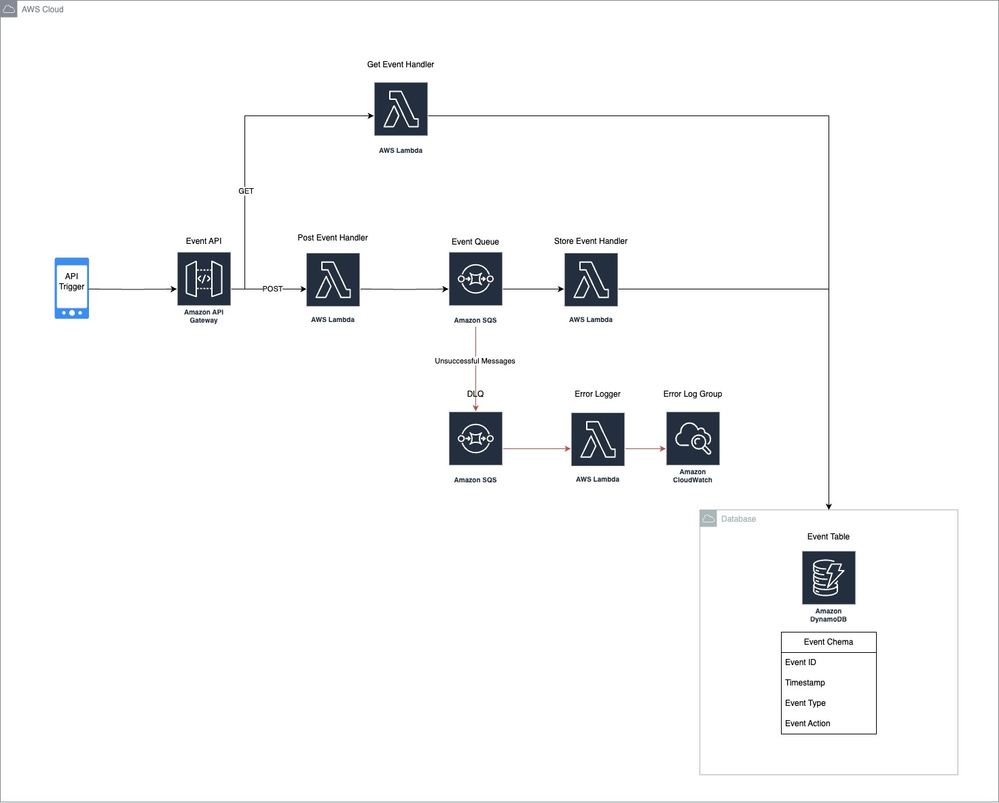

# aws-serverless-stack
Example of a complete serverless stack on AWS Cloud

# Event Processing System
This repository contains the Terraform configuration for deploying an event processing system on AWS. The system is designed to handle incoming event data through an API Gateway, process it using AWS Lambda functions, and store it in DynamoDB. The architecture also includes queue and error handling mechanisms using SQS and CloudWatch.

## Architecture Overview

The system architecture is illustrated in the diagram below:



## Components

- **API Trigger:** External entity or application that triggers API calls.
- **Amazon API Gateway:** Manages HTTP GET and POST requests.
  - GET requests are handled by the "Get Event Handler" Lambda function.
  - POST requests are handled by the "Post Event Handler" Lambda function.
- **Get Event Handler (AWS Lambda):** Retrieves and returns event data from DynamoDB for GET requests.
- **Post Event Handler (AWS Lambda):** Processes incoming event data from POST requests and sends it to the "Event Queue" (Amazon SQS).
- **Event Queue (Amazon SQS):** Buffers incoming messages from the "Post Event Handler" Lambda function to decouple the processing from the incoming request rate.
- **Store Event Handler (AWS Lambda):** Consumes messages from the "Event Queue" and stores the processed event data into the "Event Table" in DynamoDB.
- **Dead Letter Queue (DLQ - Amazon SQS):** Receives messages that fail to be processed successfully by the "Store Event Handler" to ensure they are not lost and can be inspected or retried.
- **Error Logger (AWS Lambda):** Processes messages from the DLQ and logs error details to "Error Log Group" in CloudWatch.
- **Event Table (Amazon DynamoDB):** Stores event data with the schema including Event ID, Timestamp, Event Type, and Event Action.

## Folder Structure

The repository is organized as follows:

```
├── functions (lambda functions)
│ ├── get-event
│ │ └── index.js
│ └── post-event
│   └── index.js
├── config (terraform backend config for multiple envs)
│ ├── dev
│ │ └── backend.conf
│ └── prod
│   └── backend.conf
├── scripts (deployment scripts)
│ ├── deploy-dev.sh
│ └── destroy-prod.sh
├── terraforms.tf
├── variables.tf
├── outputs.tf
├── provider.tf
└── event-api.yaml (openapi definition)

```


## Getting Started

### Prerequisites

- Terraform installed on your local machine.
- AWS CLI configured with appropriate permissions.

### Deployment

1. **Clone the Repository:**

    ```sh
    git clone https://github.com/akifabubakar/aws-serverless-stack.git
    cd aws-serverless-stack
    ```

2. **Initialize AWS PROFILE. Make sure you can access to your AWS Account through the terminal / cli,**


3. **Deploy dev:**

    ```sh
    sh ./scripts/deploy-dev.sh

    Confirm the apply step with `yes`.
    ```

### Variables

You can customize the deployment by modifying the `config/<env>/env.tfvars` file or by providing custom values through the command line or environment variables. Key variables include:

- `region`: AWS region to deploy the resources.
- `project`: Your project name.
- `env`: project env.
- `repository`: project's repo.
- `createdby`: your name.


### Cleanup

To remove all the resources created by this deployment:

```sh
./scripts/destroy-dev.sh
```
